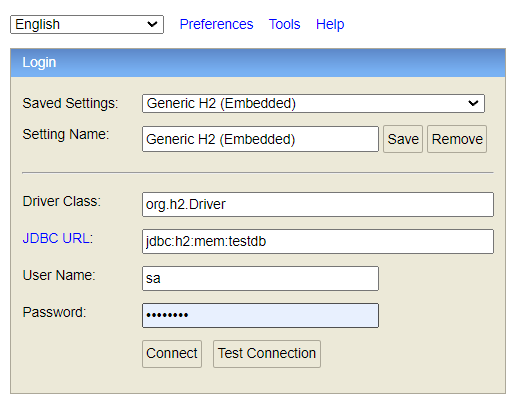
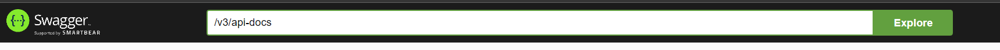
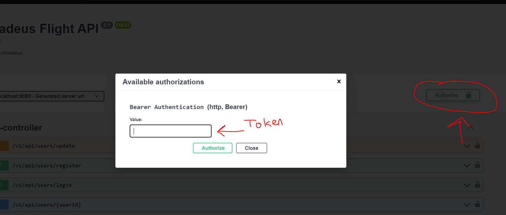
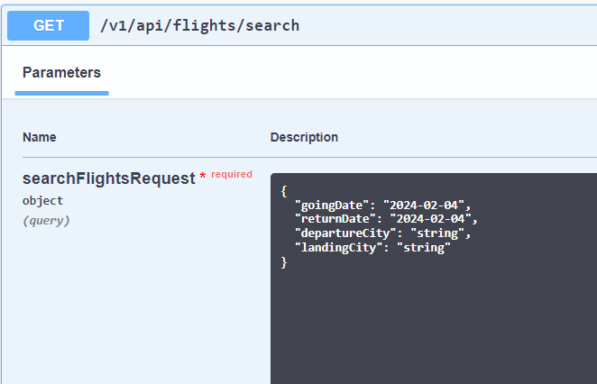

### H2-CONSOLE:
You can access the h2-console at http://localhost:8080/h2-console
You can see the dummy users, airports, flights in here.

`username` --> `sa` 
`password` --> `password`

### SWAGGER:
You can access the swagger docs at http://localhost:8080/swagger-ui/index.html
If you can't see the docs try to explore at search bar with `/v3/api-docs`

### USERS:
API uses JWT Bearer Token for authentication and authorization 
There are two users in db as admin and user 
If you want to access all endpoints login as admin!!!
- ADMIN  
`username : admin`
`password : admin` 
- USER  
    `username : user`
    `password : user`  

You can use `localhost:8080/v1/api/users/login` endpoint to login
You will get credentials as response, copy token and paste it authorize section at the above

### SEARCH-API:
You can access this endpoint without any authentication. You can access it at https://localhost:8080/v1/api/flights/search
This endpoint requires below fields;
- `goingDate` : This field type is LocalDate. It indicates your going flight day. ``REQUIRED``
- `returnDate` : This field type is LocalDAte. It indicates your return flight day. ``OPTIONAL``
- `departureCity` : This field type is String. It indicates your boarding city. You must input city name correctly exactly in db
- `landingCity` : This field type is String. It indicates your destination city. You must input city name correctly exactly in db

